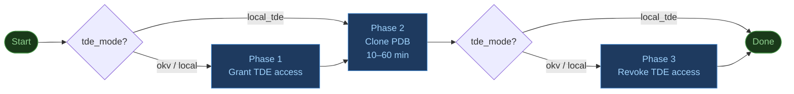

# dbaascli PDB Clone — Ansible automation for ExaCS

> **This is a proof-of-concept/MVP with educational purpose.** It demonstrates how to automate `dbaascli` from Ansible and is not intended for production use as-is. Passwords are stored in plain text in the inventory, error handling is minimal, and only the `local_tde` mode has been tested end-to-end.

This playbook automates PDB cloning on Oracle Exadata Cloud Service using `dbaascli`, Oracle's native CLI for ExaCS. The goal is to show how to orchestrate from Ansible a process that, done manually, requires several steps and answering interactive password prompts on the console.

## The problem

`dbaascli` is interactive: it prompts for passwords at multiple points during execution. It does not accept them via stdin or as command-line arguments. A plain Ansible `shell:` task would hang waiting for input.

The solution is `expect`, a tool that simulates an interactive terminal and responds to prompts automatically.

## What it does

Clones a PDB from a source CDB to a target CDB on ExaCS. Optionally creates it as a **refreshable PDB**, which allows syncing it back to the source at any time with `ALTER PLUGGABLE DATABASE ... REFRESH`.

The process has three phases:



- **Phase 1** — grants the target CDB access to the source OKV wallet so it can read the TDE keys. Only needed in `okv` mode.
- **Phase 2** — runs the actual clone: `dbaascli pdb remoteClone`. Takes between 10 and 60 minutes depending on PDB size.
- **Phase 3** — revokes OKV wallet access. Always runs, even if Phase 2 failed, to leave the environment clean.

With `tde_mode: local_tde` (TDE managed locally by each CDB), phases 1 and 3 are skipped and only the clone runs.

## How passwords are handled

`dbaascli` was designed to be run by a DBA at a terminal — not from a script. There is no `--password` flag, no environment variable, no stdin pipe. The only way to pass credentials is to respond to interactive prompts as they appear. That is the core challenge of automating this with Ansible.

For `pdb remoteClone` pilot asks for 4 passwords in sequence:

```
pdb_admin_password
remote_db_sys_password
source_pdb_exported_tde_key_file_password  (ignored for non-12.1 databases)
db_link_user_password
```

In this implementation all passwords are the same (`db_password`). The expect script sends it 4 times with one-second pauses between sends, one per prompt.

The `sleep 1` delays are intentional. Because `dbaascli` provides no signal that it is ready for the next input, passwords are sent blind into the TTY buffer. The delays give each layer time to consume its password before the next one arrives.

### Why a temp file instead of `expect -c`

The obvious first approach is `expect -c "..."`. The problem is that Tcl does not interpret backslash-newline as line continuation inside `-c` strings. If the `spawn` command spans multiple lines, `sleep` and `send` get concatenated as arguments to spawn, and `dbaascli` rejects them with:

```
[FATAL] Invalid argument passed from command line: sleep
```

The fix is to write the script to a temp file with real newlines. The flow in each role:

1. `copy` — writes the `.exp` file to `/tmp/` with `no_log: true` so the password never appears in Ansible logs.
2. `shell` — runs `/usr/bin/expect /tmp/.script.exp`.
3. `always` — deletes the file regardless of success or failure.

## TDE modes

| Mode | When to use |
|---|---|
| `local_tde` | TDE managed locally by each CDB. Simplest, tested and working. |
| `okv` | Oracle Key Vault in production. Requires all three phases. |
| `local` | Wallet as a local file. For development without OKV. |

## Prerequisites

The playbook assumes the infrastructure already exists. Before running it, a common user `C##...` must exist in the source CDB with `CREATE SESSION`, and a database link must exist in the target CDB pointing to the source.

## Inventory

The `inventory/clones.yml` file is excluded from the repository because it contains passwords. Example:

```yaml
---
clone_jobs:
  vars:
    ansible_connection: ssh
    ansible_user: opc
    ansible_private_key_file: "/home/user/.ssh/exacs.key"
    ansible_become: true
    ansible_become_user: root
    tde_mode: local_tde
    refreshable_pdb: true
    refresh_mode: MANUAL
    dblink_username: "C##DBLINK"
    db_password: "password_here"

  hosts:
    clone_pdb01:
      ansible_host: 10.0.0.1
      source_db: PROD_CDB
      target_db: TEST_CDB
      source_pdb: PROD_DATA
      target_pdb: PROD_DATA_CLONE
      source_db_connection_string: "10.0.0.1:1521/PROD_CDB_service.subnet.vcn.oraclevcn.com"
```

`source_db_connection_string` uses EZ-Connect format (`host:port/service`). The full service name is available in the OCI console or via:

```sql
SELECT value FROM v$parameter WHERE name = 'service_names';
```

## Running

```bash
# Optional: run prerequisite checks only — the clone is skipped (recommended first time)
ansible-playbook playbook.yml -i inventory/clones.yml -e "run_prereqs=true"

# Run the clone (prereqs skipped, assumes they already passed)
ansible-playbook playbook.yml -i inventory/clones.yml
```

With `tde_mode: local_tde` the Ansible output looks like this:

```text
TASK [Phase 1 - Grant TDE Access] ******************
skipping: [clone_pdb01]

TASK [clone_pdb : Write expect script to temp file] *
changed: [clone_pdb01]

TASK [clone_pdb : Execute PDB remote clone] *********
changed: [clone_pdb01]

TASK [clone_pdb : Log clone success] ****************
ok: [clone_pdb01]

TASK [clone_pdb : Remove expect script] *************
changed: [clone_pdb01]

TASK [Phase 3 - Revoke TDE Access] ******************
skipping: [clone_pdb01]
```

## Logs

Each run writes a log on the Ansible controller with the Job ID and remote log paths captured from dbaascli output:

```
/tmp/dbaascli-clones/clone_pdb01_20260330T091234.log
```

```text
PHASE 2 (CLONE): SUCCESS - PDB PROD_DATA cloned to PROD_DATA_CLONE
  Job id: f220eea6-934d-4f87-9abf-a50fd0bb810f
  Session log: /var/opt/oracle/log/TEST_CDB/pdb/remoteClone/dbaastools_2026-03-30_07-43-46-AM_339060.log
  Log file location: /var/opt/oracle/log/TEST_CDB/pdb/remoteClone/pilot_2026-03-30_07-44-00-AM_340312
```

The detailed dbaascli and pilot logs remain on the remote ExaCS host:

```
/var/opt/oracle/log/<target_db>/pdb/remoteClone/
```

## Verifying the clone

Connect to the target CDB as SYSDBA and run:

```sql
-- Confirm the PDB exists and is refreshable
SELECT pdb_name, status, refresh_mode
FROM dba_pdbs
WHERE pdb_name = '<TARGET_PDB>';
```

Expected output:

```
PDB_NAME            STATUS       REFRESH_MODE
------------------- ------------ ------------
PROD_DATA_CLONE     REFRESHING   MANUAL
```

`STATUS = REFRESHING` and `REFRESH_MODE = MANUAL` confirms the clone is refreshable. The PDB is created in `MOUNTED` state — open it before use:

```sql
ALTER PLUGGABLE DATABASE <TARGET_PDB> OPEN READ ONLY;
```

To trigger a manual refresh at any time:

```sql
ALTER PLUGGABLE DATABASE <TARGET_PDB> REFRESH;
```